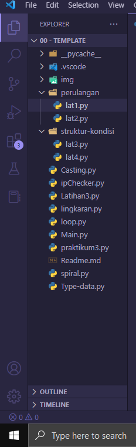
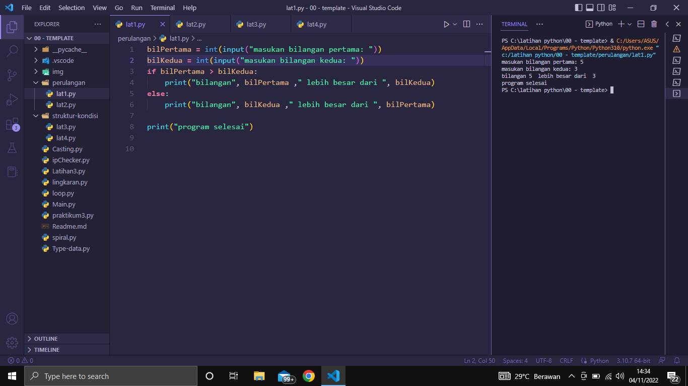
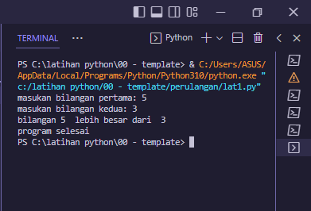
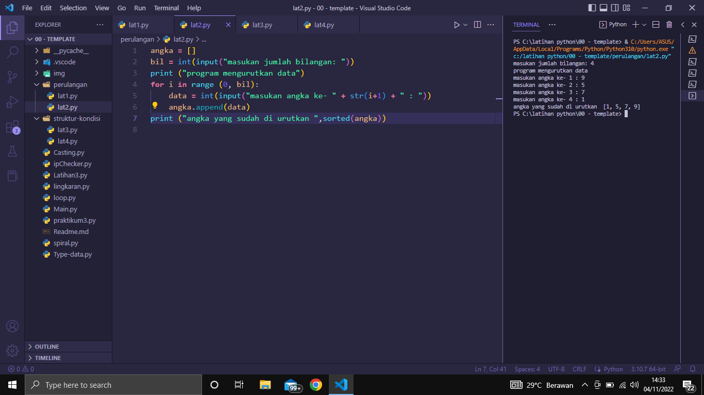
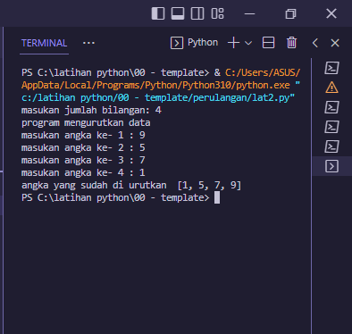
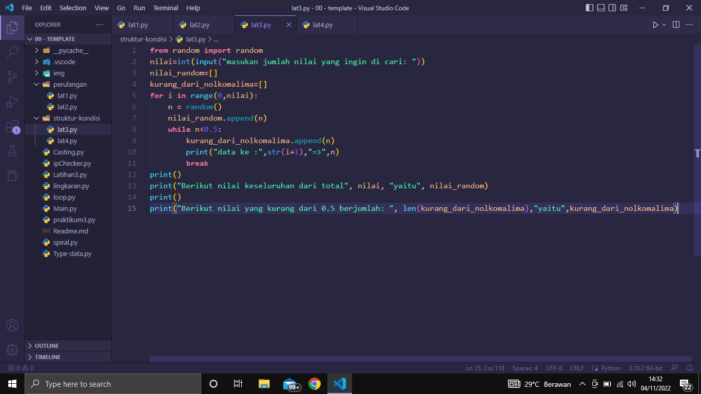
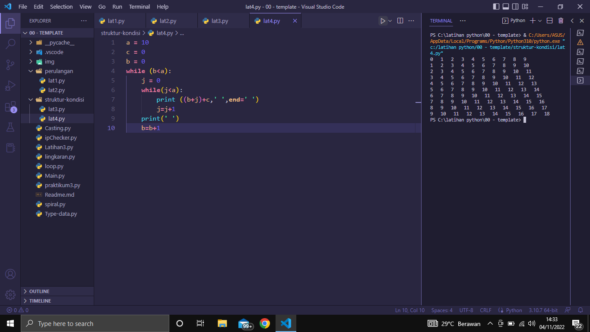
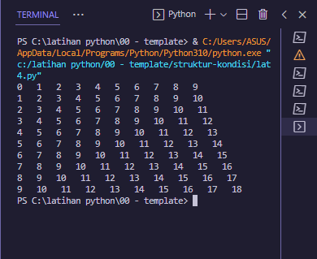

# Praktikum 4 belajar bahasa pemrograman python

# Belajar struktur dan kondisi pada python
1. pertama buat file dengan nama praktikum4, di dalam nya kita buat dua folder dengan nama `perulangan` dan `struktur kondisi` nah didalamnya kita buat file python `lat1.py` dan `lat2.py` untuk file `perulangan`. didalam file `struktur dan kondisi` kita buat dengan nama `lat3.py` dan `lat4.py` seperti gambar berikut

2. Selanjutnya kita buka file `perulangan` -> `lat1.py` dan masukan sourcecode nya berikut 

* berikut outpunya dari `lat1.py`

* berikutnya kita buka file `lat2.py` dan masukan sourcecode nya berikut

* dan berikut untuk hasil outputnya

3. Sekarang kita akan masuk ke struktur dan kondisi
pertama buka file `lat3.py` dan masukan source code nya berikut

* dan berikut hasil output dari `lat3.py`

* buka kembali file `lat4.py` kita akan membuat program struktur data, berikut code nya

* dan berikut adalah hsil outputnya

Baik sekian untuk tutorial python tentang perulangan dan struktur-kondisi
Terima kasih 